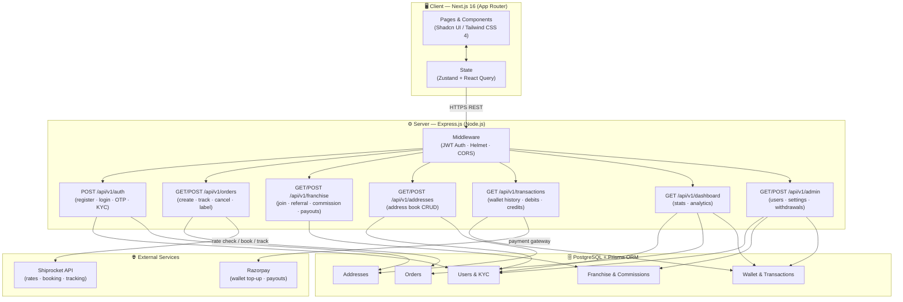
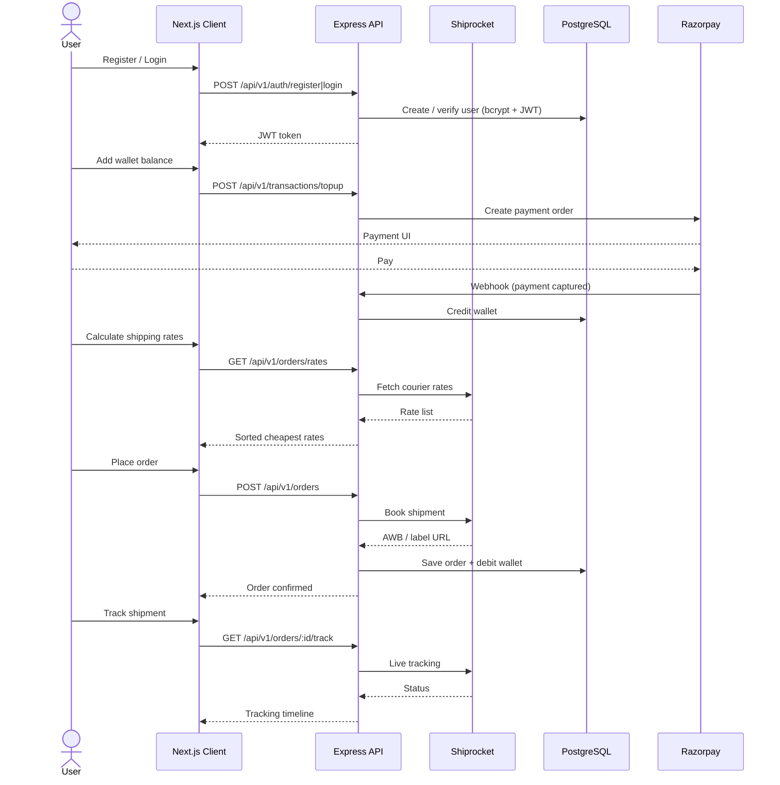
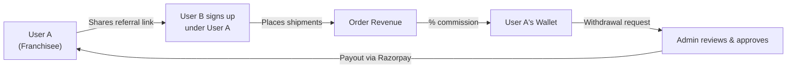

# CheapShip — Logistics & Shipping Management Platform

CheapShip is a comprehensive full-stack platform designed to simplify shipping and logistics management. It provides a seamless experience for users to calculate rates, manage orders, and grow through a dedicated franchise network, while giving administrators powerful tools to oversee the entire ecosystem.

---

## 🗺️ System Architecture



---

## 🔄 Core User Flow



---

## 🏗️ Franchise & Commission Flow



---

## 🚀 Features

### For Users
- **Smart Rate Calculator** — Instant shipping rate comparisons across courier partners via Shiprocket.
- **Order Management** — Step-by-step order creation with saved address book.
- **Franchise Network** — Referral system with commission earnings on downstream shipments.
- **Integrated Wallet** — Shipping credits, transaction history, and Razorpay-powered payouts.
- **Address Book** — Save and reuse pickup/delivery locations.

### For Administrators
- **Dashboard** — Real-time overview of platform stats, orders, and users.
- **User Management** — Account control, status toggling, and profile management.
- **Transaction Oversight** — Monitor all financial movements in the system.
- **Franchise Administration** — Set commission rates and process withdrawal requests.
- **System Settings** — Global configuration for platform-wide parameters.

---

## 🛠 Tech Stack

| Layer | Technology |
|---|---|
| **Frontend Framework** | Next.js 16 (App Router) |
| **Language** | TypeScript |
| **Styling** | Tailwind CSS 4 |
| **State Management** | Zustand & React Query |
| **UI Components** | Shadcn UI (Radix UI + Base UI) |
| **Icons** | Hugeicons |
| **Backend Framework** | Express.js (Node.js) |
| **ORM** | Prisma |
| **Database** | PostgreSQL |
| **Authentication** | JWT + BcryptJS |
| **Logistics API** | Shiprocket |
| **Payments** | Razorpay |
| **API Docs** | Swagger UI (`/api-docs`) |

---

## 📦 Project Structure

```
cheapship/
├── client/                  # Next.js frontend
│   ├── app/                 # App router pages & layouts
│   ├── components/          # Reusable UI components
│   ├── lib/                 # Hooks, stores, utilities
│   └── public/              # Static assets
└── server/                  # Express.js backend
    ├── controllers/         # Request handlers
    ├── middleware/          # JWT auth, error handling
    ├── prisma/              # DB schema & migrations
    ├── routes/              # API route definitions
    ├── services/            # Business logic layer
    └── utils/               # Helpers, Prisma client, API wrappers
```

---

## 🛠 Installation & Setup

### Prerequisites
- Node.js v18+
- PostgreSQL
- pnpm (recommended)

### Backend
```bash
cd server
pnpm install
cp .env.example .env        # fill in DB URL, JWT secret, API keys
npx prisma migrate dev
npm start
# API docs → http://localhost:3001/api-docs
```

### Frontend
```bash
cd client
pnpm install
cp .env.example .env.local  # set NEXT_PUBLIC_API_URL
pnpm dev
# App → http://localhost:3000
```

---

## 📝 License

This project is private and intended for internal use.
